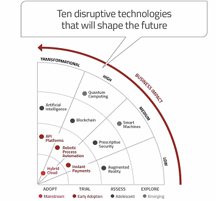

# Project Submission

At Factory24 we're always sourcing and onboarding projects with great ideas for building the 
next generation products and solutions to support the startup ecosystem. This public repository 
hosts the complete guideline of how to submit project ideas including templates and step-by-step 
instructions. 

## Scope

We are interested in onboarding projects that support both the Mission and Values of [Afrolynk](https://afrolynk.com/afrolyn2019/#section-brief). The scope of our focus areas is broad, and can include: Big data & Analytics, Artificial Intelligence, 
Internet of Things(IOT) / Smart Machines, Blockchain, Augmented Reality /Virtual Reality,  Connectivity 
(Next Gen - 5G), Cloud & Quantum computing, API platforms (integration), Robotics & Automation, Instant 
Payments and appropriate technologies (USSD).

With the ultimate goal of being the platform and the source of disruptive innovations in Africa, Factory24 
will help coordinate the efforts of teams working together to develop and build solutions that overcome 
current social-economic challenges. 

Our view is that Factory24 will play a pivotal role in transforming Africa's human capital in technology and 
leapfroging the continent into the 5th industrial revolution thus the coordination of efforts will include 
helping to connect teams, cross-promote the products and protocols, as well as provide strategic grants.

## Structure of a Submission

## Progress Reports

## Crowdfunding Platform

## Moderation and Code of Conduct

